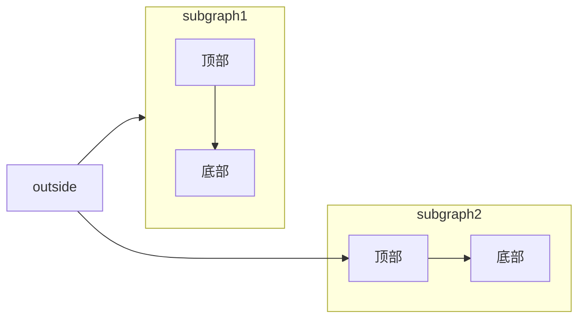

This topic explains how to configure HTTPS for the JumpServer service to ensure encrypted and secure communication.

<Steps>
  <Step>
    Log in to the JumpServer deployment server using the "root" or another user with superuser privileges.
  </Step>
  <Step>
    Place your certificate files in the following directory:

    ```sh
    /opt/jumpserver/config/nginx/cert
    ```

    Ensure the certificate files are named as follows:

    - server.crt
    - server.key
  </Step>
  <Step>
    Edit the `config.txt` file and modify the following configuration settings.

    ```sh
    vi /opt/jumpserver/config/config.txt
    ```

    Change "demo.example.com" to your actual domain name.

    ```sh
    HTTPS_PORT=443
    SERVER_NAME=demo.example.com
    SSL_CERTIFICATE=server.crt
    SSL_CERTIFICATE_KEY=server.key
    ```
  </Step>
  <Step>
    Change to the "JumpServer offline package" directory and run the command to restart the service.

    ```sh
    ./jmsctl.sh restart
    ```
  </Step>
  <Step>
    Completed.
  </Step>
</Steps>

<Steps>
  <Step title="New Step">
    
  </Step>
</Steps>

<Card title="New Card" icon="sparkles">
  
</Card>

<Card title="New Card" icon="sparkles">
  
</Card>

<Danger>
  123
</Danger>



123213